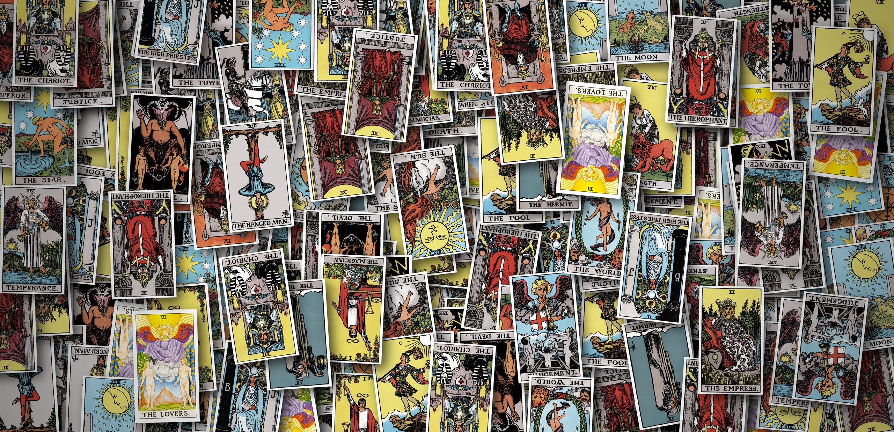

# Ethereal Tarot 🔮

<div style="width: 260px; margin: 15px 0; border-radius: 8px; overflow: hidden; box-shadow: 0 3px 8px rgba(139, 69, 19, 0.15);">
  <a href="https://github.com/zlZayn/Tarot" target="_blank">
    
  </a>
</div>

这是一个基于 WebGL (Three.js) 的 3D 塔罗牌应用程序，支持鼠标交互与摄像头手势控制。
每次抽牌完成会自动保存到浏览器本地（3 张牌与正逆位），下次打开随时回顾。

## 🪄 快速开始

**朋友 / 普通用户（只需要 Python）**

1. 安装 Python（https://www.python.org/downloads/ ，无需 Node.js）。
2. 双击根目录下的 **`Click Me.bat`**。
3. 脚本自动启动服务器并打开浏览器（端口被占用时自动顺延）。

> **注意**：必须通过本地 HTTP 服务运行。如果不用脚本，请手动在 `dist/` 目录下开启一个 HTTP 服务器（如 VS Code + Live Server），否则图片纹理将无法加载（CORS 跨域限制）。摄像头手势依赖联网加载 MediaPipe 资源，加载慢时请科学上网。

## 🖐️ 操作指南

* **鼠标模式**：
    * **拖拽**：左右滑动浏览牌堆。
    * **点击**：抽取选中的牌。


* **手势模式**（需开启摄像头，点击右下角 "Camera Off" 切换模式）：
    * **张掌**：移动光标浏览。
    * **握拳**：选中/确认。

## 🛠️ 自定义设置

### 更换牌背图案

你可以更改塔罗牌背面的图案（默认为 `bm4.png`）。

1. 将你想要的图片（推荐 .png 或 .jpg）放入 `public/textures/backs/` 文件夹中。
2. 使用记事本或代码编辑器打开 `src/config/assets.ts`。
3. 搜索关键词 `BACK_URL` 并修改文件名：

```javascript
// 修改前
const BACK_URL = "./textures/backs/bm4.png";

// 修改后 (假设你的新图片叫 my_back.jpg)
const BACK_URL = "./textures/backs/my_back.jpg";
```

4. 运行 `npm run build` 构建。
5. 刷新网页即可生效新牌背。

## 🧑‍💻 开发者

**前置**：Node.js ≥ 18 与 Python（经 uv 管理）。

**常用命令**

```bash
npm install        # 安装依赖
npm run dev        # 开发服务器 http://localhost:5173（改代码自动刷新）
npm run build      # 构建发布版到 dist/
npm run typecheck  # 类型检查
```

**四个启动入口**

| 入口 | 用途 | 适用 | 依赖 |
|---|---|---|---|
| `Click Me.bat` | 启动构建产物 `dist/`，端口顺延，自动开浏览器 | 朋友 / 普通用户 | 仅 Python |
| `Start Dev.bat` | 启动 Vite 开发服务器（改代码自动刷新，热更新） | 开发者 | Node.js |
| `Build.bat` | 类型检查 + 构建 `dist/`（发布前必跑） | 开发者 | Node.js |
| `Rich Launcher.bat` | Rich 面板：构建过期检测、确认重建、运行（O 开浏览器 / R 重建 / Q 退出） | 开发者 | Node.js + uv |

**给朋友发布**：只需 `dist/` + `Click Me.bat` + `server/serve.py` 三部分，朋友不需要 Node / uv / pip。

**测试**：资源校验与交互 E2E 见 [tests/README.md](tests/README.md)，命令速查见 [AGENTS.md](AGENTS.md)。

### 📂 项目结构

为了确保程序正常运行，请保持文件结构完整，**不要移动、删除或重命名文件与素材**。

```text
Ethereal Tarot/
├── Click Me.bat           # 🟢 启动脚本（朋友用，仅需 Python）
├── Start Dev.bat          # 📝 开发服务器（Vite 热更新）
├── Build.bat              # 🔨 构建 dist（类型检查 + 构建）
├── Rich Launcher.bat      # 🧙 开发者 Rich 面板（需 uv）
├── server/serve.py        # 本地服务器（被 Click Me.bat 调用，端口占用自动顺延）
├── launcher.py            # 开发者启动器（Rich 面板 + 构建过期检测）
├── core/ ui/              # 启动器核心逻辑层 / 渲染层（被 launcher.py 使用）
├── dist/                  # 网页程序本体 (npm run build 生成)
│   ├── index.html         # 主程序入口
│   └── textures/          # 素材文件夹
│       ├── backs/         # 牌背图片 (bm.jpg, bm2.png, bm3.png, bm4.png)
│       └── cards/         # 牌面图片 (0.jpg 愚者 ~ 21.jpg 世界，共 22 张)
└── src/                   # 源码文件夹
    ├── index.html         # 页面结构
    ├── config/assets.ts   # 图片路径配置（改图片路径改这里）
    └── ...                # 样式 / 逻辑 / 牌数据 / 多语言模块
```

## 📖 文档

* 维护索引（规则 / 命令 / 待办）→ [AGENTS.md](AGENTS.md)
* 架构设计 → [docs/ARCHITECTURE.md](docs/ARCHITECTURE.md)
* 决策记录 → [.agents/notes/](.agents/notes/)